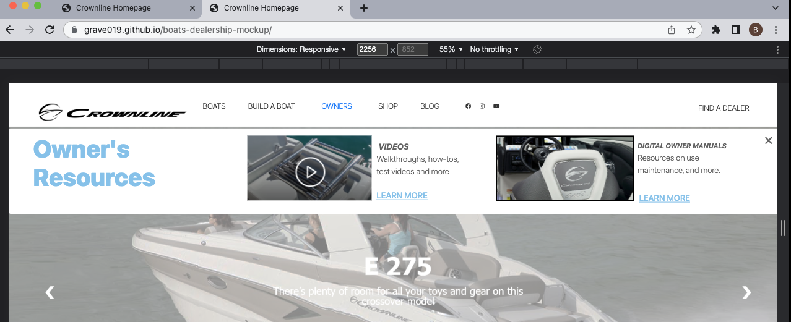
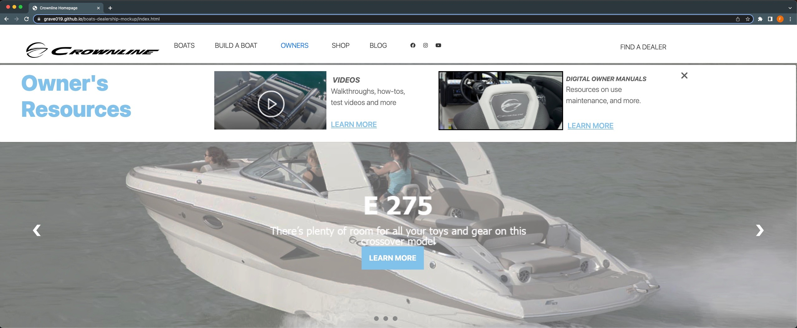
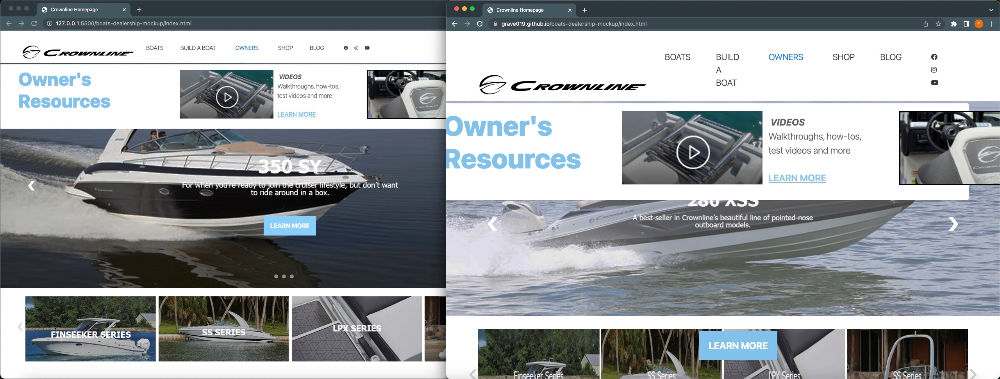
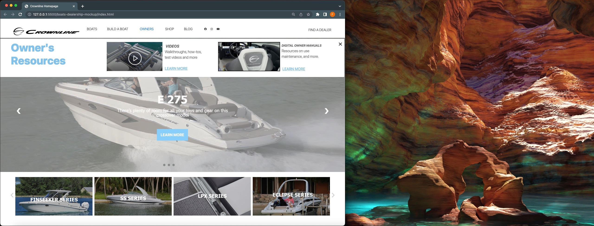

# Crownline Boat Dealership Mockup

  

## Description

  The Mockup presented to a client designed in Adobe XD. This assessment is building out a homepage, along with Boat model page and a models page. The page was built with HTML, CSS, JavaScript, and Bootstrap 5.
  
  Click the link below to visit my deployed page.

  [Crownline-Mockup-Website](https://grave019.github.io/boats-dealership-mockup/)

  ## Table of Contents
  
  * [Goals](#goals)
  * [Motivation](#motivation)   
  * [Problems](#problems)
  * [Visualizations](#Visualizations)
  * [Acknowledgements](#acknowledgements)
  * [Resources](#resources)
  * [License](#license) 
  * [Contact](#contact) 
  
  ## Goals

  * To increase the functionality of the mockup by researching the existing Crownline website. I was able to see what the client liked that already exist on their current website and expand the mockup pages for better user interface.

  * Research Bootstrap documentation along with W3 Schools to better understand coding and styling challenges that were faced in the development process.

  * Gather startup images and materials from Crownlines website to build the most accurate representation of the Mockup.  

  ## Motivation

  * Design a facsimile for a proposed update to an existing company's website for the purpose of demonstrating my current level of knowledge and capabilities.

  ## Problems

  * During the development process I've had the website open with visual studio code's Live Server in order to trouble shoot styling during the coding process. The browser width during coding was set at 1960px. However, outside of live server the navbar begins to collapse below a width of 2256px. I have provided images and link to a video displaying page functionality.
  
  * Some design elements were difficult to replicate and I tried produce them to the best of my ability. I welcome any feedback you could give on the site. 

  ## Visualizations

  Below are a images that shows layout of the navbar at 2256px wide.
  
  landing page full screen
  
  Deployed page view and page on visual studio codes live server next to one another.
  
  Full Monitor screenshot of live server page width at 1960px
  
  ## Acknowledgements

  * The design team at Red Rocket Studios for designing a mockup that was easy to follow and wonderfully designed.
  
  * Ross Bernstein and Arianna Soto at Blue Wave for relaying communication about the project along with desired expectations.

  ## Resources
 
  [Eloquent JavaScript](https://eloquentjavascript.net)

  [W3 Schools](https://www.w3schools.com)

  [Font Awesome](https://fontawesome.com/docs)

  [MDN Web Docs](https://developer.mozilla.org/en-US/docs/Web/CSS/background-attachment)

  [Bootstrap](https://getbootstrap.com)

  [Better Programming](https://betterprogramming.pub/how-to-change-the-color-of-an-image-with-css-83664f6527ac)

  [Crownline Company Website](https://crownline.com)

  [Stack OverFlow](https://stackoverflow.com)

  ## License

  Copyright 2022 Brent Graves

  Permission is hereby granted, free of charge, to any person obtaining a copy of this software and associated documentation files (the "Software"), to deal in the Software without restriction, including without limitation the rights to use, copy, modify, merge, publish, distribute, sublicense, and/or sell copies of the Software, and to permit persons to whom the Software is furnished to do so, subject to the following conditions:
  
  The above copyright notice and this permission notice shall be included in all copies or substantial portions of the Software.
  
  THE SOFTWARE IS PROVIDED "AS IS", WITHOUT WARRANTY OF ANY KIND, EXPRESS OR IMPLIED, INCLUDING BUT NOT LIMITED TO THE WARRANTIES OF MERCHANTABILITY, FITNESS FOR A PARTICULAR PURPOSE AND NONINFRINGEMENT. IN NO EVENT SHALL THE AUTHORS OR COPYRIGHT HOLDERS BE LIABLE FOR ANY CLAIM, DAMAGES OR OTHER LIABILITY, WHETHER IN AN ACTION OF CONTRACT, TORT OR OTHERWISE, ARISING FROM, OUT OF OR IN CONNECTION WITH THE SOFTWARE OR THE USE OR OTHER DEALINGS IN THE SOFTWARE.

  ## Contact
  
  GitHub Username: grave019 
 
  Link to Github account [grave019](https://github.com/grave019)

  Email: brent.r.graves82@gmail.com
